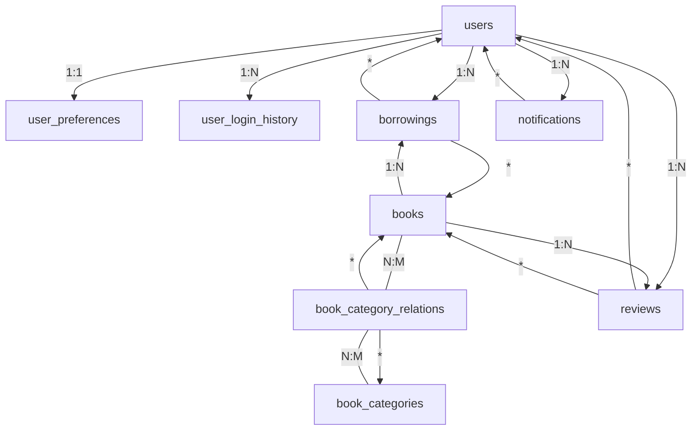

# 📚 BiblioApp – Backend Gestion de Bibliothèque

## Sommaire
- [Présentation](#présentation)
- [Installation & Configuration](#installation--configuration)
- [Démarrage](#démarrage)
- [Structure du projet](#structure-du-projet)
- [Schéma de la base de données](#schéma-de-la-base-de-données)
- [Routes API](#routes-api)
- [Système de notifications](#système-de-notifications)
- [Sécurité & Authentification](#sécurité--authentification)
- [Fonctionnalités avancées](#fonctionnalités-avancées)
- [Déploiement & Variables d'environnement](#déploiement--variables-denvironnement)
- [Schéma SQL vue d'ensemble](#schéma-sql-vue-d'ensemble)
- [Hébergement & Démonstration](#Hébergement_démonstration)


---

## Présentation
BiblioApp est une application complète de gestion de bibliothèque universitaire, avec :
- Gestion des livres, emprunts, retours, réservations
- Authentification JWT (étudiants/admins)
- Système d'avis et de notifications
- Dashboard analytics
- API RESTful documentée

## Installation & Configuration
1. **Cloner le repo**
2. **Installer les dépendances**
   ```bash
   cd backend-gestion-biblio
   npm install
   ```
3. **Configurer l'environnement**
   - Copier  `.env` et adapter les variables (voir section dédiée)
4. **Lancer la base de données**
   - MySQL local ou Railway (voir `.env`)
5. **Démarrer le serveur**
   ```bash
   npm run dev
   # ou
   nodemon server.js
   ```

## Structure du projet

### Racine du projet
```
Biblio_app/
├── backend-gestion-biblio/      # Backend Express/Node.js (API, DB, services)
├── frontend-gestion-biblio/     # Frontend React/Vite (interface utilisateur)
├── docker-compose.yml           # Orchestration multi-conteneurs
├── schema_complet.sql           # Schéma SQL complet
├── README.md                    # Documentation globale
```

### Backend (backend-gestion-biblio)
```
backend-gestion-biblio/
├── controllers/         # Logique métier (Books, Users, Reviews...)
├── models/              # Accès aux données (ORM custom)
├── routes/              # Définition des routes Express
├── middleware/          # Middlewares (auth, validation, upload...)
├── services/            # Services (Email, NotificationScheduler...)
├── database/            # Scripts SQL, migrations, schéma
├── uploads/             # Fichiers uploadés (couvertures, profils)
├── scripts/             # Scripts utilitaires
├── config/              # Config DB, email, etc.
├── Dockerfile           # Conteneurisation
└── ...
```

### Frontend (frontend-gestion-biblio)
```
frontend-gestion-biblio/
├── src/
│   ├── components/      # Composants UI réutilisables
│   ├── pages/           # Pages principales (Admin, Livres, etc.)
│   ├── services/        # Appels API, gestion auth, etc.
│   ├── hooks/           # Hooks React custom
│   ├── contexts/        # Contexts globaux (auth, thème...)
│   ├── config/          # Configurations globales
│   ├── data/            # Données statiques ou mocks
│   └── ...
├── public/              # Fichiers statiques (favicon, robots.txt...)
├── app/                 # Entrée Vite/React (routing)
├── Dockerfile           # Conteneurisation frontend
├── package.json         # Dépendances et scripts
├── vite.config.ts       # Config Vite
└── ...
```

## Schéma de la base de données
- Voir `database/SCHEMA_EVOLUTION.md` et `schema_complet.sql` pour le détail des tables, vues, triggers, index, contraintes, etc.
- Principales tables : `users`, `books`, `borrowings`, `reviews`, `notifications`, `book_categories`, etc.

## Routes API
### Authentification
- `POST /api/auth/login` : Connexion (JWT)
- `POST /api/auth/register` : Inscription
- `GET /api/auth/me` : Infos utilisateur connecté

### Livres
- `GET /api/books` : Liste (filtres, pagination)
- `GET /api/books/:id` : Détail d'un livre
- `POST /api/books` : Ajouter (admin)
- `PUT /api/books/:id` : Modifier (admin, partiel possible)
- `DELETE /api/books/:id` : Supprimer (admin)
- `GET /api/books/:id/reviews` : Avis d'un livre
- `POST /api/books/:id/reviews` : Ajouter un avis

### Emprunts
- `GET /api/borrowings` : Liste des emprunts (admin ou user)
- `POST /api/borrowings` : Emprunter un livre
- `PUT /api/borrowings/:id/return` : Retourner un livre
- `PUT /api/borrowings/:id/renew` : Renouveler un emprunt

### Utilisateurs
- `GET /api/users` : Liste (admin)
- `GET /api/users/:id` : Détail
- `PUT /api/users/:id` : Modifier profil
- `DELETE /api/users/:id` : Désactiver

### Notifications
- `GET /api/notifications` : Liste des notifications utilisateur
- `PUT /api/notifications/:id/read` : Marquer comme lue

### Analytics
- `GET /api/analytics/overview` : Statistiques générales
- `GET /api/analytics/borrowings` : Stats emprunts

### Autres
- `GET /api/books/genres` : Genres disponibles
- `GET /api/books/popular-authors` : Auteurs populaires

#### Toutes les routes protégées nécessitent un JWT valide (header `Authorization: Bearer ...`).

## Système de notifications
- **Types** : rappel d'échéance, retard, approbation, général
- **Envoi** :
  - Email (via Gmail/SMTP)
  - Notification in-app (stockée en DB)
- **Planification** :
  - Tâche cron (NotificationScheduler.js) pour les rappels/retards
- **Gestion** :
  - Marquage lu/non-lu
  - Expiration automatique possible
- **Configuration** :
  - Préférences utilisateur (activer/désactiver certains types)

## Sécurité & Authentification
- JWT pour toutes les routes sensibles
- Rôles : étudiant, admin (détection automatique par email ou via la DB)
- Middleware d'authentification et d'autorisation
- Validation des entrées (express-validator)
- CORS configuré pour le frontend

## Fonctionnalités avancées

- **Gestion des rôles** :
  - Détection automatique : emails contenant "admin", "direction", "bibliothecaire" → rôle admin
  - Sécurité : le frontend ne peut pas forcer le rôle, détection côté backend
- **Profils utilisateurs complets** :
  - Informations personnelles étendues
  - Préférences personnalisables
  - Statistiques d'utilisation
  - Historique de connexion
- **Analytics et reporting** :
  - Vues SQL optimisées pour les dashboards
  - Statistiques pré-calculées
  - Support pour l'export de données
- **Système de notifications** :
  - Types multiples (rappels, retards, approbations)
  - Expiration automatique
  - Gestion de l'état lu/non-lu

## Déploiement & Variables d'environnement
- `.env` à la racine
- Variables principales :
  - `DB_HOST`, `DB_USER`, `DB_PASSWORD`, `DB_NAME`, `PORT`
  - `JWT_SECRET`, `EMAIL_USER`, `EMAIL_PASS`, `EMAIL_SERVICE`
  - `FRONTEND_URL`, `VITE_API_URL`
- Dockerfile et docker-compose fournis
- Hébergement sur Railway, Vercel, etc.

## Détection automatique des rôles

- Le rôle est renvoyé dans le JWT et dans la réponse `/api/auth/login`.
- Le frontend adapte l'interface selon le rôle reçu (dashboard admin ou étudiant).
- Détection automatique du rôle selon l’email (admin ou étudiant).
  - Exemple : `admin@bibliotheque.2ie.edu` → rôle `admin`
  - Exemple : `etudiant@etu.2ie-edu.org` → rôle `student`

---

## 🗺️ Schéma SQL (vue d'ensemble)



- **users** : Utilisateurs (étudiants/admins)
- **user_preferences** : Préférences utilisateur (1:1)
- **user_login_history** : Historique des connexions (1:N)
- **books** : Livres
- **book_categories** : Catégories de livres
- **book_category_relations** : Relation N:M livres-catégories
- **borrowings** : Emprunts (user/book)
- **reviews** : Avis (user/book)
- **notifications** : Notifications utilisateur


## Hébergement / Démonstration

- **Frontend** : https://frontend-gestion-biblio-2ietamsir.vercel.app
- **Backend/API** : https://backend-gestion-biblio-production.up.railway.app

La variable d’environnement VITE_API_URL du frontend pointe bien vers l’API Railway :
```
VITE_API_URL=https://backend-gestion-biblio-production.up.railway.app

---
